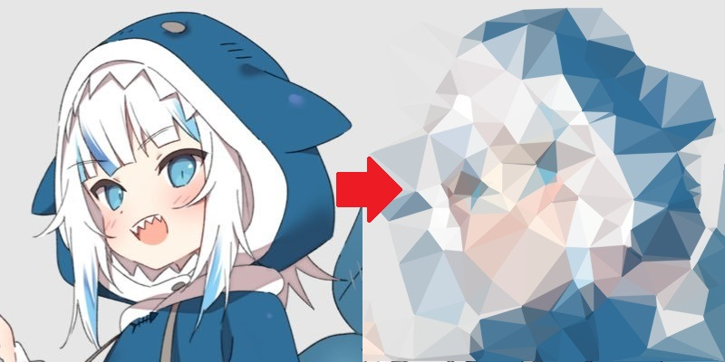

Triangulate Tool CLI
====================

> Easily convert any image into low-poly art

Convert  to 

How it works
------------

The tool creates a defined amount of random points and runs a [Delaunay Triangulation](https://en.wikipedia.org/wiki/Delaunay_triangulation)
on it. It then averages out the colours in the source image for each triangle in
order to generate the low-poly image.

Usage
-----

```bash
./triangulate-tool input_image output_image [total_points] [total_points_per_side]
```

- `total_points` (default: `100`): `int` of total random points in the image
- `total_points_per_side` (default: `3`): `int` total points on each edge of the
  image (does not count towards `total_points`)

Build process
-------------

```bash
mkdir build; cd build
cmake ..
make
```

Requirements
------------

- OpenCV 2.x  (via apt: `libopencv-dev`)
- CMake 2.8 or above  (via apt: `cmake`)

License
-------

This software is licensed under the [MIT License](http://jay.mit-license.org/2015)
